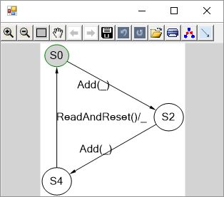
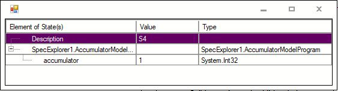
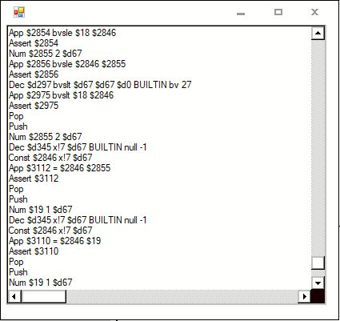

# SpecExplorer2010Reviver
Use Spec Explorer 2010

PROLOG
======
Spec Explorer 2010 is a symbolic code exploration tool based on XRTs. 
It can also translate .Net programs into constraint solver formulas and solves these equations using Z3.

Here we present a demo program which can run Spec Explorer from its open command interface and after that displays the exploration results using the Spec Explorer API. Generated test cases can also be executed with the stub code added as a zip file in the binaries-folder. As a side effect the demo can be fully executed even without the need of Visual Studio Professional. 

See also:  
Spec Explorer Dokumentation: https://msdn.microsoft.com/en-us/library/ee620518.aspx  
Spec Explorer Blog: https://blogs.msdn.microsoft.com/specexplorer/

REQUIREMENTS
======
This tool here is a minimal demo reviving the original Spec Explorer plug-in binaries.
Some binaries used are even open source on GitHub like Z3, MSAGL and SpecSharp some are under closed source license like XRTs. 

The original IDE's of the Spec Explorer plug-in are:  
Microsoft Visual Studio Professional 2010 Version 10.0.30319.1 RTMREL 
Microsoft Visual Studio Professional 2012 Version 11.0.50727.1 RTMREL 

With these IDE versions the Spec explorer plug-in can be installed directly. But it can be installed also on newer Visual Studio Professional versions using this guide:  
https://github.com/philscrace2/SpecExplorer2010 

This program here is compatible of course with these versions above but with adding just the binaries of the original plug-in it compiles and works with any compiler targeting Microsoft .NET Framework Version 4.0 (see FAQ).

All binaries needed are used from Spec Explorer for Visual Studio 2010 (version 3.5.3146.0) - included here only for convenience.
It is very highly recommended to please download them yourself and unpack them from Microsoft MSI file (msiexec /a SpecExplorer.msi /qb TARGETDIR=C:\Data\):  
https://marketplace.visualstudio.com/items?itemName=SpecExplorerTeam.SpecExplorer2010VisualStudioPowerTool-5089

USAGE
======
Try to compile a Spec Explorer demo-model: See the StaticModel-folder.  
(Repair missing links to libraries using the binaries in the SpecExplorer2010Binaries-folder)

Try to compile the Reviver and explore the demo-model-binaries using Spec Explorer 2010: See the Reviver-folder.  
(Repair missing links to libraries using the binaries in the SpecExplorer2010Binaries-folder,
Adapt all the absolute paths in main!)

EPILOG
======
This demo can display the explored states, but exporting this state data is still a challenge.
The state comparator is not added yet. 

Everything here is licensed under MICROSOFT PRE-RELEASE SOFTWARE LICENSE TERMS. 
All the credits go to Microsoft, the original Microsoft Spec Explorer Team and all the other supporting Microsoft employees and users.
